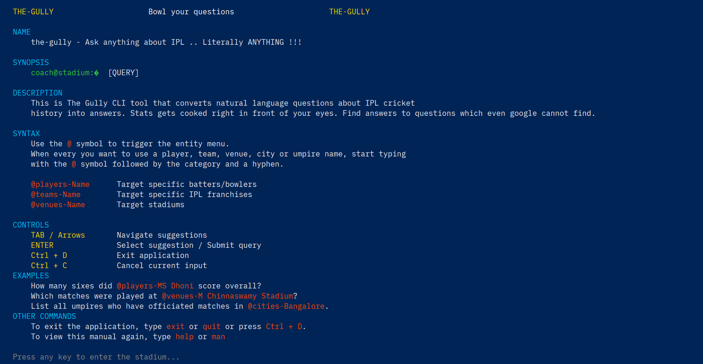
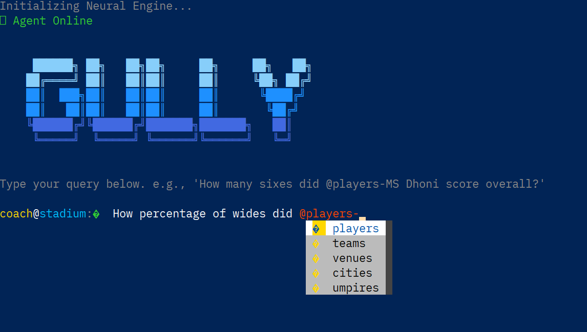
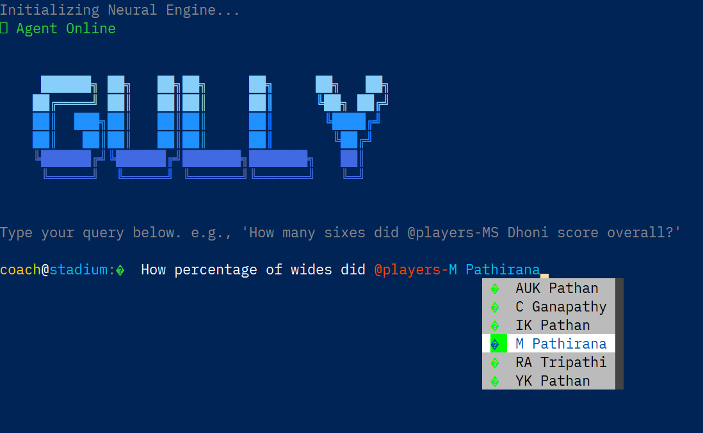
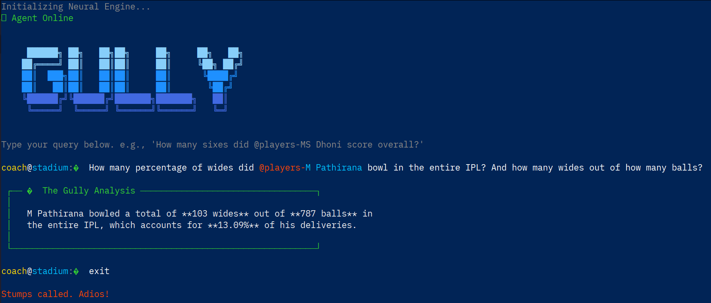

# Gully: A Natural Language Interface for Cricket Analytics


```text
 ██████╗ ██╗   ██╗██╗     ██╗     ██╗   ██╗
██╔════╝ ██║   ██║██║     ██║     ╚██╗ ██╔╝
██║  ███╗██║   ██║██║     ██║      ╚████╔╝ 
██║   ██║██║   ██║██║     ██║       ╚██╔╝  
╚██████╔╝╚██████╔╝███████╗███████╗   ██║   
 ╚═════╝  ╚═════╝ ╚══════╝╚══════╝   ╚═╝   
```

Gully is a sophisticated application that allows you to query a rich database of Indian Premier League (IPL) cricket statistics using plain English. It leverages a powerful AI agent to understand natural language, translate it into precise SQL queries, and fetch answers directly from ball-by-ball data.


> Currently the backed logic is implemented with proper authentication and authorization. **Frontend is yet to be built**

> Instead the CLI version is completely built

This applications plans to use **discord like tagging** (mentions) mechanism to maintain name consistency. Syntax for tagging is given below

`NOTE: The dataset used is publically available. Please consider upvoting in kaggle. Use this and make more amazing project than mine 😂.`


[Kaggle Publically available Dataset link](https://www.kaggle.com/datasets/astrasv247/ipl-dataset-2008-2025-ball-by-ball)

## Showcase
I have build a dummy frontend using the backedn endpoints (without auth integrations)


This is the man page


This is the how the discord like tagging mechanism



And the question is asked here
As a hardcore CSK fan I want to know how many wides did Pathirana bowl (As far as I remember most matches were catch practice between dhoni and pathirana 🤣)


And there you go. He bowled 13.09% wide. NO wonder pathirana is the GOAT of wides 😂😂


## CLI Tool Syntax

Use the `@` symbol to trigger the entity menu.

Whenever you want to use a player, team, venue, city, or umpire name, start typing with the `@` symbol followed by the category and a hyphen.

* `@players-Name` — Target specific batters/bowlers
* `@teams-Name` — Target specific IPL franchises
* `@venues-Name` — Target stadiums
* `@umpires-Name` — Target umpires
* `@cities-Name` — Target city name


### Controls

| Key Binding | Action |
| :--- | :--- |
| `TAB` / `Arrows` | Navigate suggestions |
| `ENTER` | Select suggestion / Submit query |
| `Ctrl + D` | Exit application |
| `Ctrl + C` | Cancel current input |

### EXAMPLES

* How many sixes did `@players-MS Dhoni` score overall?
* Which matches were played at `@venues-M Chinnaswamy Stadium`?
* List all umpires who have officiated matches in `@cities-Bangalore`.

### OTHER COMMANDS

* To exit the application, type `exit` or `quit` or press `Ctrl + D`.
* To view this manual again, type `help` or `man`.


## Key Features

- **Natural Language Queries:** Ask complex questions about IPL history in plain English.
- **AI-Powered SQL Agent:** An intelligent agent dynamically generates SQL queries from your questions.
- **RESTful API:** A robust backend built with FastAPI provides scalable endpoints for chat, user management, and authentication.
- **Database Management:** Uses SQLAlchemy and Alembic for seamless database schema management and migrations.
- **Data Processing Pipeline:** Includes scripts to process raw Cricsheet JSON data into a structured database format.
- **Command-Line Interface:** Provides a CLI for direct interaction and testing.

## Technology Stack

- **Backend:** Python, FastAPI, Uvicorn
- **Database:** PostgreSQL, SQLAlchemy, Alembic
- **AI / NLP:** LLM-powered agents (framework-agnostic), custom query tagging and lexing
- **Dependency Management:** `uv`
- **CLI** - Prompt Toolkit(python)

## Getting Started

Follow these steps to set up and run the project locally.

### 1. Prerequisites

- Python 3.10+
- PostgreSQL database server
- `git` for cloning the repository

### 2. Initial Setup

1.  **Clone the repository:**
    ```bash
    git clone https://github.com/Astrasv/the-gully.git
    cd gully
    ```

2.  **Create a virtual environment:**
    ```bash
    python -m venv .venv
    # Activate the environment
    # Windows
    .venv\Scripts\activate
    # macOS / Linux
    source .venv/bin/activate
    ```

3.  **Install dependencies using `uv`:**
    ```bash
    pip install uv
    uv pip install -r requirements.txt
    ```

4.  **Configure Environment Variables:**
    Copy the example environment file and update it with your database credentials and a secret key.
    ```bash
    cp .env.example .env
    ```
    Now, edit the `.env` file with your details.

### 3. Database Preprocessing Setup (Need not do this step - Use my kaggle dataset)

1.  **Set up the database schema:**
    Navigate to the backend directory and run the Alembic migrations. This will create all the necessary tables.
    ```bash
    cd backend
    alembic upgrade head
    cd ..
    ```

2.  **Prepare the IPL Data:**
    - Download the official IPL ball-by-ball data in JSON format from the [Cricsheet Website](https://cricsheet.org/matches/).
    - Place the downloaded JSON files into the `ipl_json/` directory at the root of the project.

3.  **Populate the Database:**
    Run the preprocessing and population script. This will read the JSON files, process the data, and insert it into your PostgreSQL database.
    ```bash
    python db/populate.py
    ```
### 4. Actual Database Setup
 1.  **Set up the database for IPL table:**
    Navigate to the backend directory and run the Alembic migrations. This will create all the necessary tables.
    ```bash
    \c ipl_database
    
    and 

    \i db/setup_db.sql

    and 

    COPY ipl_ball_by_ball
    FROM '/path/to/your_file.csv' (which you downloaded from my kaggle)
    DELIMITER ','
    CSV HEADER;

    ```


### 5. Running the Application

Once the setup is complete, you can run the agents server.

```bash
fastapi run --reload --port 8001 /agents/app/main.py
```
The API will be live at `http://127.0.0.1:8001`, and the interactive OpenAPI documentation will be available at `http://127.0.0.1:8001/docs`.

After this run the backend server

```bash
fastapi run --reload --port 8000 /backend/app/main.py
```

The API will be live at `http://127.0.0.1:8000`, and the interactive OpenAPI documentation will be available at `http://127.0.0.1:8000/docs`.


>NOTE:  If you want to only access the CLI application start just the agents server


## Usage

### API Interaction
The primary way to use Gully is through its REST API. You can use tools like `curl`, Postman, or any HTTP client to interact with the endpoints. The `/api/chat/` endpoint is the main entry point for asking questions.

### Command-Line Interface (CLI)
A simple CLI is available for quick tests from your terminal.
```bash
python main_cli.py
```


## License

This project is licensed under the terms of the MIT License. See the `LICENSE` file for details.